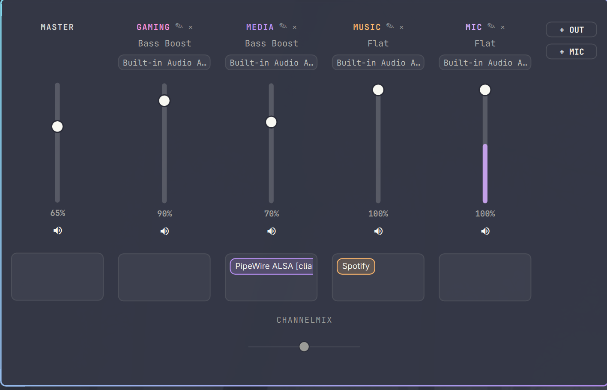
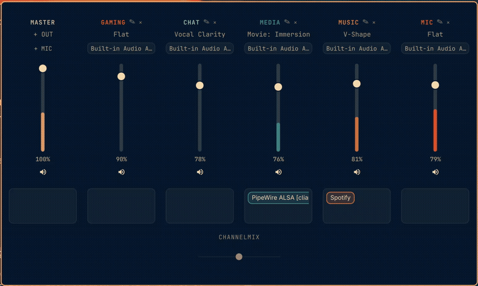

# Waveform for Omarchy

A SteelSeries Sonar-inspired per-application audio mixer, built as an
Omarchy bar plugin. Create named channels, drag running apps into them,
shape each channel with its own 12-band EQ, and fade between two groups of
channels with ChannelMix — all live, all from the bar.




## Features

- **Real channels, not a UI trick.** Each channel is its own hosted
  PipeWire filter-chain client, running as a `systemd --user` unit that
  survives reboot — a genuine virtual sink (or, for mic-type channels, a
  genuine virtual source) other apps can see and route to, not a fake
  mixer bus.
- **Drag-and-drop app routing.** Grab a running app's pill and drop it
  onto a channel. Routing is instant and actively re-enforced, so it
  sticks even if the app's stream disappears and comes back (e.g. a
  browser tab going idle and resuming).
- **Output *and* input (mic) channels.** Route real microphones through a
  channel's EQ too, exposed as a virtual mic other apps can pick up —
  same channel model, same drag-and-drop, same EQ.
- **12-band parametric EQ**, backed by a real LSP LV2 plugin per channel,
  editable by dragging points on the curve. Changes apply live to the
  running audio graph — no restart, no dropout, no pop.
- **A live spectrum analyzer** renders behind the EQ curve as you shape
  it, colored as a gradient across the active Omarchy theme's own
  palette.
- **EQ presets** — six built-in curves, plus save your own under any name
  and delete any preset, built-in or custom.
- **Per-channel device picker** — a dropdown under each channel listing
  every real output device (or, for a mic channel, every real input
  device), populated live as devices connect or disconnect.
- **ChannelMix** — drag any group of channels onto either side of a
  balance slider (e.g. game audio on one side, voice chat on the other)
  and fade between them. This never touches a channel's own volume; it
  only fades a separate output stage, so your own fader stays exactly
  where you left it.
- **Drag to reorder channels** — grab a channel's name and drop it onto
  another to reorder the mixer.
- **Theme-native.** Every channel gets a distinct, stable color hashed
  from the active Omarchy theme's own palette — updates live on a theme
  switch, no restart needed.
- **Bar-aware popup placement**, matching how native Omarchy plugins
  behave: centered on screen if the icon sits in the center of the bar,
  edge-aligned if it's been moved to the left or right section.

## Requirements

- [Omarchy](https://omarchy.org/) (Quickshell-based bar/shell)
- **[LSP Plugins](https://lsp-plug.in/)** (`lsp-plugins-lv2`) — powers the
  per-channel EQ
- **[cava](https://github.com/karlstav/cava)** — powers the live spectrum
  analyzer behind the EQ curve

Install both from the `extra` repo:

```bash
sudo pacman -S lsp-plugins-lv2 cava
```

Waveform checks for both whenever the panel opens and tells you directly
if either is missing — a banner in the mixer if `lsp-plugins-lv2` isn't
found (channels can't process audio without it), or a small note in the
EQ view if `cava` isn't found (only the live spectrum behind the curve is
affected; EQ editing itself still works). Install the missing piece and
reopen the panel — no restart needed.

## Installation

```bash
omarchy plugin add https://github.com/JMThomas00/omarchy-waveform.git --enable
```

Or manually:

```bash
git clone https://github.com/JMThomas00/omarchy-waveform.git \
  ~/.config/omarchy/plugins/waveform
omarchy plugin enable jmthomas00.waveform center
```

Move it around the bar with `omarchy bar move jmthomas00.waveform --section <left|center|right>`.

## Removal

```bash
omarchy plugin remove jmthomas00.waveform
```

Or manually:

```bash
omarchy plugin disable jmthomas00.waveform
rm -rf ~/.config/omarchy/plugins/waveform
```

Either path stops and removes every channel's own hosted PipeWire client
and systemd unit along with it. Waveform's own state
(`~/.config/waveform/`) and each channel's rendered PipeWire/systemd
files (`~/.config/pipewire/waveform-channel-*.conf`,
`~/.config/systemd/user/waveform-channel-*.service`) live outside the
plugin directory, so `rm -rf` on the plugin folder alone won't clean
those up if you skip `omarchy plugin remove` — delete them by hand if you
uninstall manually and want a completely clean slate.

## Usage

- **Click the icon** to open the mixer. MASTER controls your system's
  overall output; every channel to its right is one you've created.
- **"+ OUT" / "+ MIC"** create a new output or input channel.
- **Drag an app's pill** from any channel's box into another channel (or
  back to MASTER) to reroute it.
- **Click a channel's name** to open its EQ — drag points on the curve to
  shape it, pick a preset from the row above, or save your own curve as a
  new named preset.
- **Drag a channel's name onto another channel's name** to reorder the
  mixer.
- **Drag a channel's name onto either side of the ChannelMix bar** at the
  bottom to group it there; drag the slider to fade between the two
  sides. Click a chip's "×" to remove a channel from ChannelMix — the
  fader resets to centered.
- **The dropdown under each channel's preset name** lists real devices —
  click to switch what that channel targets.
- **The speaker icon** below each fader toggles mute for that channel.

## How it works, briefly

Each channel is a small `pipewire -c waveform-channel-<id>.conf` process,
managed by its own `systemd --user` unit, hosting a
`libpipewire-module-filter-chain` block. Its capture side is the virtual
sink apps play into (or, for a mic channel, the real device audio is
captured from); its filter graph is an LSP parametric-EQ LV2 plugin; its
playback side is the real device the channel actually targets. This
mirrors the pattern Omarchy's own built-in speaker-tuning feature already
uses for filter-chain-based EQ — Waveform just gives every channel one of
these, instead of one for the whole system.

EQ changes apply live by writing straight to the running filter-chain
client's LV2 control ports over `pw-cli`/PipeWire's own protocol — no
process restart, so nothing routed to that channel ever glitches or
pauses mid-tweak. A restart only happens for genuine topology changes
(renaming a channel, switching its target device), and channel creation
and deletion follow the same render → install → verify → roll-back-on-
failure discipline as Omarchy's own audio tooling.

App routing is drag-and-drop plus a lightweight reconciliation timer:
dropping an app pill onto a channel moves it instantly
(`pactl move-sink-input`) and records the intent; a short-interval timer
compares every live stream's actual sink against that intent and
re-applies it on any drift, so routing survives an app's stream
disappearing and reappearing without needing a WirePlumber rule reload
(which, tested directly, doesn't retroactively re-link an already-playing
stream anyway).

## License

[MIT](LICENSE)
